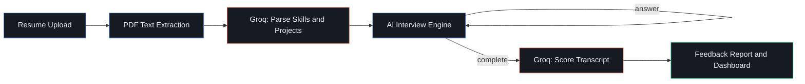

<div align="center">


<br/>


**An AI interview platform that reads your actual resume, interviews you on your actual projects, and hands back a scored feedback report — no generic quiz-app questions.**

<div>

[](https://your-deployed-link.vercel.app/)
[](https://github.com/ayushxdev01/InterviewX-AI/issues)
[](https://github.com/ayushxdev01/InterviewX-AI/issues)

</div>

</div>

<br/>

## ✨ Overview

**InterviewX AI** simulates a real technical hiring process end-to-end. It parses your resume into structured data, runs a resume-aware AI mock interview with adaptive follow-ups, and generates a detailed scored feedback report — all in a custom dark, developer-console styled UI.

Instead of a static question bank, every interview is generated live from *your* actual projects, skills, and experience — and the AI is explicitly guarded against inventing facts you never said.

<br/>

## 🚀 Core Features

<div align="center">

| Feature | What it does |
|---|---|
| 🧠 **Resume-Aware Interviewer** | Parses your PDF resume and generates questions from your real skills & projects |
| 💬 **Adaptive Follow-Ups** | Vague or low-effort answers get pushed back on instead of skipped past |
| 🚫 **Anti-Hallucination Guardrails** | The AI never invents metrics or facts you didn't actually say |
| 🛑 **Graceful Early Exit** | If you're genuinely stuck, the AI wraps up the interview politely instead of grinding on |
| 📷 **Practice Camera** | Self-view only webcam preview — nothing recorded, nothing analyzed |
| 📈 **Score Trend Dashboard** | Overall / Technical / Communication scores charted across sessions |
| 📄 **One-Click PDF Export** | Download your transcript or feedback report |
| 🔐 **Google OAuth** | Secure sign-in via Supabase Auth, no password management |
| 🎨 **Custom Design System** | Dark developer-console aesthetic — not a generic AI template |

</div>

<br/>

## 🖥️ Preview

> _Add a screenshot or screen recording of the landing page / interview chat / feedback report here._

<br/>

## 🏗️ Tech Stack

<div align="center">


</div>

<br/>

## 📂 Project Structure

```
InterviewX-AI/
├── app/
│   ├── api/
│   │   ├── resume/parse/route.ts        # PDF upload → text extraction → AI parsing
│   │   └── interview/
│   │       ├── start/route.ts            # Generates the first resume-aware question
│   │       ├── [id]/message/route.ts     # Handles each answer, generates next question
│   │       ├── [id]/edit/route.ts        # Rewinds & regenerates from an edited answer
│   │       └── [id]/feedback/route.ts    # Generates the scored feedback report
│   ├── auth/callback/route.ts            # Supabase OAuth callback
│   ├── components/                        # Logo, MagneticButton, TiltCard
│   ├── dashboard/                          # Resume upload, score analytics
│   ├── interview/[id]/                     # Live chat + feedback report pages
│   ├── login/                              # Google sign-in
│   └── page.tsx                            # Landing page
├── lib/supabase/                           # Browser / server / middleware clients
├── middleware.ts                           # Session refresh + route protection
└── supabase-setup*.sql                     # Database schema & RLS policies
```

<br/>

## ⚡ Getting Started

### 1. Clone the repo

```bash
git clone https://github.com/ayushxdev01/InterviewX-AI.git
cd InterviewX-AI
```

### 2. Install dependencies

```bash
npm install --legacy-peer-deps
```

### 3. Set up environment variables

Create a `.env.local` file:

```env
NEXT_PUBLIC_SUPABASE_URL=your_supabase_url
NEXT_PUBLIC_SUPABASE_ANON_KEY=your_supabase_anon_key
NEXT_PUBLIC_SITE_URL=http://localhost:3000
GROQ_API_KEY=your_groq_api_key
```

Get a free Groq key at [console.groq.com](https://console.groq.com/keys) and set up a free Supabase project at [supabase.com](https://supabase.com).

### 4. Set up the database

Run each `supabase-setup*.sql` file in your Supabase SQL Editor, and create a private `resumes` storage bucket.

### 5. Run the server

```bash
npm run dev
```

Open **http://localhost:3000** 🎉

<br/>

## ☁️ Deployment

<div align="center">

[](https://vercel.com/new)

</div>

Connect your GitHub repo to Vercel and add the environment variables from `.env.local` in the project settings.

<br/>

## 🧠 How It Works



1. Resume is uploaded and parsed into structured skills/projects/experience data
2. Groq (Llama 3.3) generates the first resume-aware question
3. Each answer is evaluated for substance — vague replies get a follow-up, not a new topic
4. Once complete, the full transcript is scored and summarized into a feedback report
5. Scores are tracked over time on the dashboard

<br/>

## 🗺️ Roadmap

**Shipped ✅**
- Google Auth · Resume parsing · AI mock interviews · Feedback reports · Score dashboard · PDF export · Practice camera

**Planned 🔮**
- Live coding judge with test-case execution
- Voice interview (speech-to-text, delivery scoring)
- AI-analyzed video interview (body language, eye contact, confidence scoring)
- Company-specific question banks
- Recruiter panel / candidate ranking
- GitHub & LeetCode profile analyzers

<br/>

## 🤝 Contributing

Contributions, issues, and feature requests are welcome!

1. Fork the repo
2. Create your feature branch (`git checkout -b feature/amazing-feature`)
3. Commit your changes (`git commit -m 'Add amazing feature'`)
4. Push to the branch (`git push origin feature/amazing-feature`)
5. Open a Pull Request

<br/>

## 📜 License

Distributed under the MIT License. See `LICENSE` for more information.

<br/>

## 👤 Author

<div align="center">

**Ayush Gupta**

[](https://github.com/ayushxdev01)
[](https://www.linkedin.com/in/ayushgupta3105/)

</div>

<br/>

<div align="center">

### ⭐ If you found this project useful, consider giving it a star!

</div>