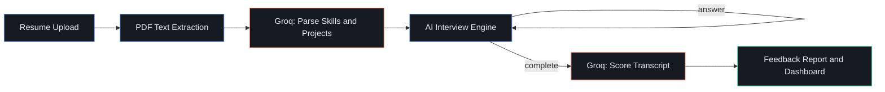

<br/>

## ⚡ Getting Started

### 1. Clone the repo

```bash
git clone https://github.com/ayushxdev01/InterviewX-AI.git
cd InterviewX-AI
```

### 2. Install dependencies

```bash
npm install --legacy-peer-deps
```

### 3. Set up environment variables

Create a `.env.local` file:

```env
NEXT_PUBLIC_SUPABASE_URL=your_supabase_url
NEXT_PUBLIC_SUPABASE_ANON_KEY=your_supabase_anon_key
NEXT_PUBLIC_SITE_URL=http://localhost:3000
GROQ_API_KEY=your_groq_api_key
```

Get a free Groq key at [console.groq.com](https://console.groq.com/keys) and set up a free Supabase project at [supabase.com](https://supabase.com).

### 4. Set up the database

Run each `supabase-setup*.sql` file in your Supabase SQL Editor, and create a private `resumes` storage bucket.

### 5. Run the server

```bash
npm run dev
```

Open **http://localhost:3000** 🎉

<br/>

## ☁️ Deployment

<div align="center">

**🔴 Live at: [interviewx-ai-ayushxdev.vercel.app](https://interviewx-ai-ayushxdev.vercel.app/)**

[](https://vercel.com/new)

</div>

Connect your GitHub repo to Vercel and add the environment variables from `.env.local` in the project settings.

<br/>

## 🧠 How It Works



1. Resume is uploaded and parsed into structured skills/projects/experience data
2. Groq (Llama 3.3) generates the first resume-aware question
3. Each answer is evaluated for substance — vague replies get a follow-up, not a new topic
4. Once complete, the full transcript is scored and summarized into a feedback report
5. Scores are tracked over time on the dashboard

<br/>

## 🗺️ Roadmap

**Shipped ✅**
- Google Auth · Resume parsing · AI mock interviews · Feedback reports · Score dashboard · PDF export · Practice camera

**Planned 🔮**
- Live coding judge with test-case execution
- Voice interview (speech-to-text, delivery scoring)
- AI-analyzed video interview (body language, eye contact, confidence scoring)
- Company-specific question banks
- Recruiter panel / candidate ranking
- GitHub & LeetCode profile analyzers

<br/>

## 🤝 Contributing

Contributions, issues, and feature requests are welcome!

1. Fork the repo
2. Create your feature branch (`git checkout -b feature/amazing-feature`)
3. Commit your changes (`git commit -m 'Add amazing feature'`)
4. Push to the branch (`git push origin feature/amazing-feature`)
5. Open a Pull Request

<br/>

## 📜 License

Distributed under the MIT License. See `LICENSE` for more information.

<br/>

## 👤 Author

<div align="center">

**Ayush Gupta**

[](https://github.com/ayushxdev01)
[](https://www.linkedin.com/in/ayushgupta3105/)

</div>

<br/>

<div align="center">

### ⭐ If you found this project useful, consider giving it a star!

</div>
